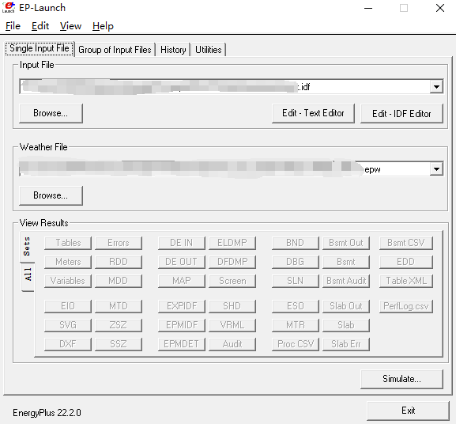
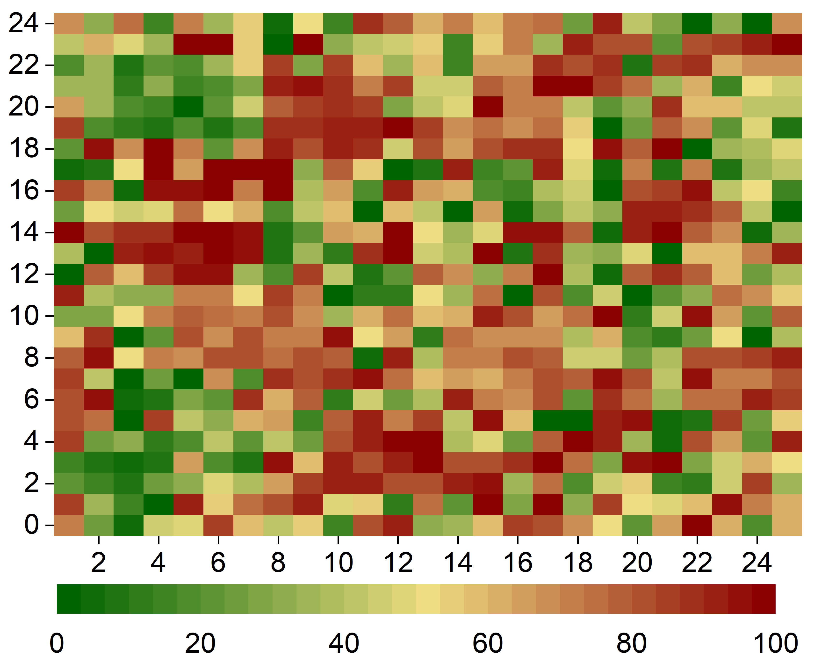
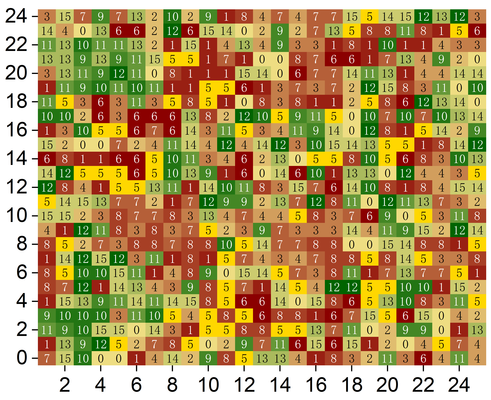

# HEEUP_rebuttal-Reviewer-4

About **EnergPlus**. If you are interested, you can further refer to:
- Simulator: https://energyplus.net/
- Related data standards: https://www.energy.gov/eere/buildings/new-construction-commercial-referencebuildings 
- EnergyPlus_Graphical_Interace
  

Please provide information according to relevant data standards to obtain idf (detailed indicators of various types of energy consumption that buildings may produce) and epw (related weather energy consumption indicators). After input, the energy consumption specific to the building will be simulated. 

- [Link example_epw](./1A_USA_FL_MIAMI.epw)

- [Link example_idf](./RefBldgFullServiceRestaurantNew2004_v1.3_5.0_1A_USA_FL_MIAMI.idf)

- [Link example_input_output](./RefBldgFullServiceRestaurantNew2004_v1.3_5.0_1A_USA_FL_MIAMI.html)
---
## Figure 5(b) Supplement

What we want to show through the illustration is that the goal of HEEUP is not only to reduce energy consumption, but also to ensure the rationality of the overall layout of urban structure, land use configuration and architectural design.

Note that different building types within the 25x25 grid form independent building distributions (building types in table 1). Different building distributions form corresponding urban structure types (Table 3). For example, a large number of Large offices are distributed to form Compact high-rise. In addition, each building type energy consumption and urban structure type corresponds to specific energy consumption standards (Table 2, Table 4). Below are detailed descriptions of two supplementary charts:

- **Figure 1 (left): Figure 5(b) in the manuscript.**
   - Shows the relative energy intensity distribution of all buildings within a 25x25 grid.
   - Use a color gradient (from green to red) to represent energy consumption levels, with green representing low energy consumption and red representing high energy consumption, to visually display the energy distribution status of the entire area.

- **Figure 2 (right): LCZ categories corresponding to the distribution of building types.**
   - Shows the relative energy intensity of all buildings distribution in each 25x25 grid to which LCZ category they correspond.
   - Each grid cell is color-coded to represent a specific LCZ category, using a color gradient (from green to red) to represent energy consumption levels, with green representing low energy consumption and red representing high energy consumption, reflecting the impact of building structure and vegetation cover Urban microclimate.

**By comparison, it can be found that the energy consumption of buildings in the grid area is consistent with that of urban structures. 
This proves that the HEEUP planning strategy is based on reasonable layout.**

  
  

---
- **Table 1: Building Types**
  
| Code | Building Type              | Code | Building Type               |
|------|----------------------------|------|-----------------------------|
| 0    | Strip mall                 | 8    | Quick service restaurant    |
| 1    | Stand-alone retail         | 9    | Full service restaurant     |
| 2    | Secondary school           | 10   | Outpatient health care      |
| 3    | Primary school             | 11   | Medium office               |
| 4    | Small hotel                | 12   | Supermarket                 |
| 5    | Small office               | 13   | Large hotel                 |
| 6    | Midrise apartment          | 14   | Large office                |
| 7    | Warehouse                  | 15   | Hospital                    |

- **Table 2: Building Type Energy Consumption**

| Code | Energy Usage (kWh) |  Code | Energy Usage (kWh) |
|------|--------------------|------|--------------------|
| 0    | 4,439.06           |  8    | 3,307.50           |
| 1    | 5,186.65           |  9    | 5,643.98           |
| 2    | 65,149.95          |  10   | 21,095.52          |
| 3    | 14,070.69          |  11   | 9,477.88           |
| 4    | 9,170.01           |  12   | 24,177.49          |
| 5    | 984.60             |  13   | 54,797.58          |
| 6    | 3,981.91           |  14   | 96,722.39          |
| 7    | 5,192.43           |  15   | 135,819.14         |

- **Table 3: Local Climate Zone (LCZ)**

| Code | Building Themes        | Code | Building Themes             |
|------|------------------------|------|-----------------------------|
| 0    | Compact high-rise      | 8    | Heavy industry              |
| 1    | Compact midrise        | 9    | Dense trees                 |
| 2    | Compact low-rise       | 10   | Scattered trees             |
| 3    | Open high-rise         | 11   | Bush, scrub                 |
| 4    | Open midrise           | 12   | Low plants                  |
| 5    | Open low-rise          | 13   | Bare rock or paved          |
| 6    | Large low-rise         | 14   | Sparsely built              |
| 7    | Lightweight low-rise   | 15   | Water                       |

- **Table 4: Local Climate Zone Energy Consumption**

| LCZ  | Energy Consumption (kWh) |  LCZ  | Energy Consumption (kWh) |
|------|---------------------------|------|---------------------------|
| 0    | 1,701,204.86              |  8    | 2,275,585.12              |
| 1    | 2,279,408.75              |  9    | 34,655.61                 |
| 2    | 1,740,707.20              |  10   | 12,466.32                 |
| 3    | 1,905,982.95              |  11   | 236,784                   |
| 4    | 1,775,184.72              |  12   | 12,323.35                 |
| 5    | 3,423,751.57              |  13   | 623,545.11                |
| 6    | 5,326,511.59              |  14   | 933,454.423               |
| 7    | 2,059,901.91              |  15   | 246,323.32                |

Codes and dataset can be found at [HEEUP_Energy_Efficient GitHub Repository](https://anonymous.4open.science/r/HEEUP).

